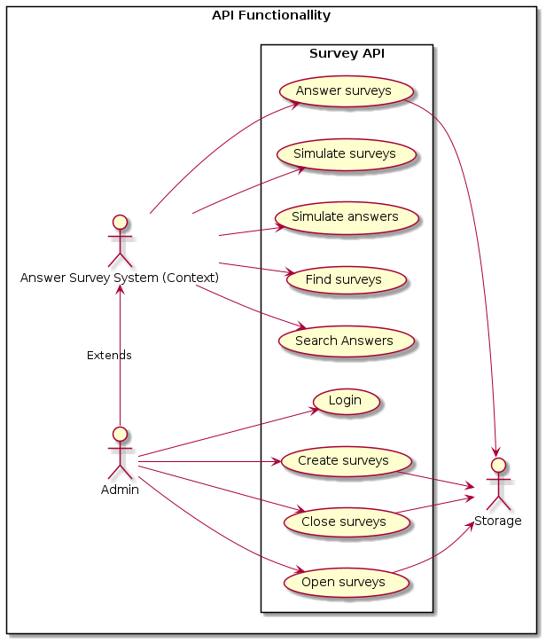
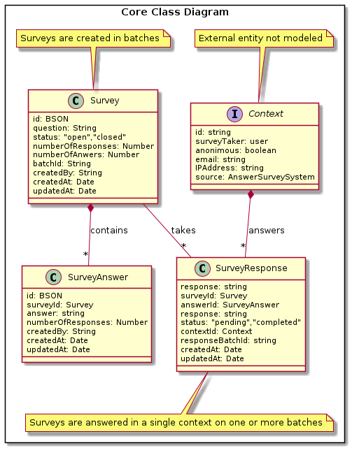
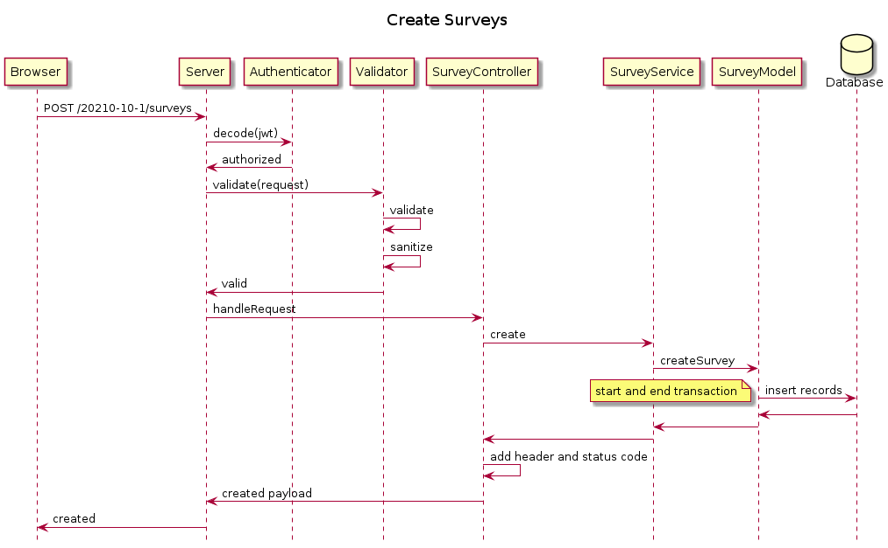

# Jodel Tech Challenge

Build an API that enables the creation and taking of user surveys.

## Table of Contents

- [Solution](#solution)
- [API Documentation](http://surveyapi.s3-website-us-west-2.amazonaws.com)
- [Installation](#installation)
- [Running the Application](#running-the-application)
- [Testing using Simulations](#testing-using-simulations)
- [Software Stack](#software-stack)
- [Directory Structure](#directory-structure)

## Solution

The Jodel REST API survey. This solution simplifies the creation and taking of user surveys.

Users take surveys in different modalities, such us anonymously, at once, in stages over time, directly, thru third parties, or by questionnaire. Therefore, the API introduces the concept of "context" and "batch."

The context represents the mentioned modalities, and the batch consists of an auto-generated identifier for grouping purposes.

However, the solution at this development iteration uses the "context" as an attribute instead of modeling it.

### System Functionallity

The following Use Case Diagram shows the API's functionality.



### Static Structure

The following Class Diagram shows the business classes and their relations.



### Design Architecture

The design follows the Domain-Driven-Design architecture when possible. So, the application consists of three layers: Application, Domain, and Infrastructure. The Infrastructure layer validates all the incoming requests prior to calling the Business Layer.

The following sequence diagram illustrates the design architecture in action.



## Installation

```
 1. git clone https://github.com/rogermori/survey-api-de.git
 2. npm install
 3. Edit the .env file and set the MONGODB_URI variable.
    MONGODB_URI=YOUR_REPLICA_SET_URI
```

## Running the Application

Change directory to the application's root directory. Then you can run the application in production, development and test modes.

### Production

```
 1. npm run build
 2. npm run start
```

### Development

```
 1. npm run build
 2. npm run dev
```

### Test

```
 1. npm run build
 2. npm run dev
```

## Testing using Simulations

The directory rest.client contains an .http file that could be used for consuming the API's end points. To sent request to the API you need to install the VS-Code extension [Rest Client](https://marketplace.visualstudio.com/items?itemName=humao.rest-client). This extension allows also to convert a request into cURL syntax.

To test the application using the API, firt you need to create a set of surveys. The API includes a Simulation Surveys' end point to generate random surveys. After creating the surveys keep the batchId number on file to create the answers. Please see the [application documentation](http://surveyapi.s3-website-us-west-2.amazonaws.com)

To respond or answer a set of surveys you need to provide a list of answers. The API includes a Simulation Answers' end point to generate random answers by batchId.

Happy testing!

## Software Stack

This application uses NodeJS 16+, JavaScript ES6 and Typescript.

The webserver consist of a Express 4 module.

The repository consist of MongoDB 4.4.10 Replica Set cluster hosted in the AWS cloud. The repository's maximum size is 500 MB. The database already includes the indexes. The application connects using a mongodriver and support transactions.

The test suite encomphases a Jest module.

## 📁 Directory Structure

```
——————
  | -- apidoc                       // HTML generated API documentation
  | -- docs                         // documents directory
  | -- dist                         // Typescript output directory
  | -- rest.client                  // Rest client files for testing purposes.
  | -- src                          // source code
      | -- application.controllers  // Application Layer
      | -- domain.services          // Domain Layer
      | -- infrastructure.express   // Express server
      | -- infrastructure.mongodb   // MongoDB models, and aggregations.
      | -- config                   // system configuration
      | -- index.ts                 // entry point core files
      | -- lib                      // utility functions and classes
  | -- __tests__                    // test directory

```
